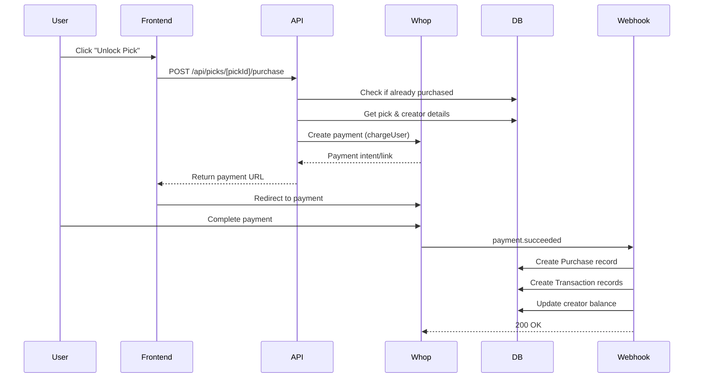
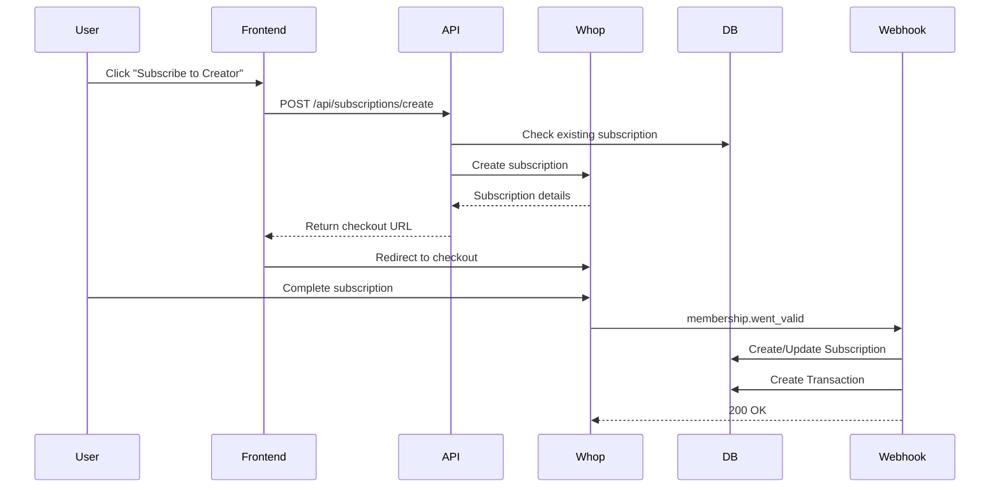

# EdgeBook Payment System Architecture

## System Overview

The payment system will integrate Whop as the primary payment processor, supporting both one-time purchases (picks) and recurring subscriptions (creator subscriptions).

## Architecture Components

### 1. Payment Processing Flow

#### A. Pick Purchase Flow


#### B. Subscription Flow


### 2. API Endpoints Structure

```typescript
// Payment Routes
/api/payments/
  ├── config/                         // GET/PATCH payment configuration (admin)
  ├── methods/                        // GET available payment methods
  └── stats/                          // GET payment statistics (admin)

/api/picks/[pickId]/
  ├── purchase/                       // POST purchase pick (replaces unlock)
  └── refund/                         // POST refund purchase (admin/automated)

/api/subscriptions/
  ├── create/                         // POST create subscription
  ├── cancel/                         // POST cancel subscription
  ├── update/                         // PATCH update subscription
  └── [subscriptionId]/               // GET subscription details

/api/creators/
  ├── earnings/                       // GET creator earnings
  ├── subscribers/                    // GET creator subscribers
  └── subscription-settings/          // GET/PATCH subscription pricing

/api/withdrawals/
  ├── request/                        // POST request withdrawal
  ├── history/                        // GET withdrawal history
  └── [withdrawalId]/                 // GET withdrawal status

/api/webhooks/
  └── whop/                          // POST Whop webhook handler

/api/admin/payments/
  ├── transactions/                   // GET all transactions
  ├── payouts/                       // GET/POST manage payouts
  ├── refunds/                       // POST process refunds
  └── config/                        // GET/PATCH platform settings
```

### 3. Service Layer Architecture

```typescript
// lib/services/payment/

├── whop.service.ts                  // Whop API integration
│   ├── chargeUser()                 // One-time charges
│   ├── createSubscription()         // Recurring subscriptions
│   ├── cancelSubscription()         // Cancel subscriptions
│   ├── transferToUser()             // Payouts/withdrawals
│   └── validateWebhook()            // Webhook verification

├── payment.service.ts               // Payment business logic
│   ├── processPurchase()           // Handle pick purchases
│   ├── processSubscription()       // Handle subscriptions
│   ├── calculateFees()             // Fee calculation
│   ├── validatePayment()           // Payment validation
│   └── checkDuplicatePurchase()    // Prevent duplicate purchases

├── payout.service.ts                // Payout management
│   ├── calculateEarnings()         // Calculate creator earnings
│   ├── requestPayout()             // Initiate payout
│   ├── processAutoPayout()         // Automatic withdrawals
│   ├── validatePayoutThreshold()   // Check minimum payout
│   └── handlePayoutFailure()       // Failure handling

├── subscription.service.ts          // Subscription management
│   ├── createSubscription()        // New subscription
│   ├── updateSubscription()        // Change subscription
│   ├── cancelSubscription()        // Cancel subscription
│   ├── checkAccess()               // Verify subscription access
│   └── handleRenewal()             // Renewal processing

├── webhook.service.ts               // Webhook processing
│   ├── handlePaymentSucceeded()    // Payment success
│   ├── handlePaymentFailed()       // Payment failure
│   ├── handleMembershipValid()     // Subscription active
│   ├── handleMembershipInvalid()   // Subscription inactive
│   └── processWebhookQueue()       // Async processing

└── admin.service.ts                 // Admin functions
    ├── updatePlatformFee()         // Change platform fee
    ├── processRefund()             // Issue refunds
    ├── viewTransactions()          // Transaction reporting
    └── managePayout()              // Manual payout control
```

### 4. Frontend Components

```typescript
// components/payment/

├── PickPurchaseButton.tsx          // Unlock pick button
├── SubscriptionButton.tsx          // Subscribe to creator
├── PaymentMethodSelector.tsx       // Choose payment method
├── PurchaseConfirmModal.tsx        // Confirm purchase dialog
├── SubscriptionManager.tsx         // Manage subscriptions
├── EarningsDisplay.tsx            // Show creator earnings
├── WithdrawalForm.tsx             // Request withdrawal
├── PaymentHistory.tsx             // Transaction history
└── AdminPaymentConfig.tsx         // Admin configuration

// hooks/
├── usePayment.ts                   // Payment operations
├── useSubscription.ts              // Subscription state
├── useEarnings.ts                  // Earnings tracking
└── useWithdrawal.ts                // Withdrawal management
```

### 5. Configuration Management

```typescript
// Configuration structure
interface PaymentConfig {
  platformFee: {
    percentage: number;           // 15% default
    minimum: number;              // Min fee in cents
    maximum: number;              // Max fee in cents
  };

  pricing: {
    pick: {
      minimum: number;            // $0.50
      maximum: number;            // $10,000
    };
    subscription: {
      minimum: number;            // $4.99
      maximum: number;            // $999.99
    };
  };

  withdrawals: {
    minimum: number;              // $10 minimum
    autoWithdrawThreshold: number; // Auto withdraw at $100
    enabled: boolean;
    methods: PayoutMethod[];
  };

  provider: {
    name: 'whop';
    apiKey: string;
    webhookSecret: string;
    environment: 'test' | 'production';
  };
}
```

### 6. Security Measures

1. **Payment Security**
   - Webhook signature verification
   - Idempotency keys for retries
   - Rate limiting on payment endpoints
   - Fraud detection rules

2. **Access Control**
   - Authentication required for all payment operations
   - Role-based permissions for admin functions
   - IP-based restrictions for webhook endpoints
   - Audit logging for all transactions

3. **Data Protection**
   - No storage of sensitive payment data
   - Encrypted webhook payloads
   - Secure API key management
   - PCI compliance through Whop

### 7. Error Handling

```typescript
// Error types
enum PaymentErrorType {
  INSUFFICIENT_FUNDS = 'insufficient_funds',
  CARD_DECLINED = 'card_declined',
  DUPLICATE_PURCHASE = 'duplicate_purchase',
  INVALID_AMOUNT = 'invalid_amount',
  SUBSCRIPTION_EXISTS = 'subscription_exists',
  WITHDRAWAL_BELOW_MINIMUM = 'withdrawal_below_minimum',
  WEBHOOK_VALIDATION_FAILED = 'webhook_validation_failed',
  PAYOUT_FAILED = 'payout_failed'
}

// Error handling strategy
- Retry logic for transient failures
- User-friendly error messages
- Admin notifications for critical errors
- Automatic rollback for failed transactions
```

### 8. Performance Optimizations

1. **Database**
   - Indexes on frequently queried fields
   - Batch processing for bulk operations
   - Connection pooling
   - Query optimization

2. **Caching**
   - Redis for payment configuration
   - User purchase cache
   - Subscription status cache
   - Rate limit counters

3. **Queue Processing**
   - Background jobs for webhooks
   - Async payout processing
   - Batch transaction processing
   - Retry queue for failures

### 9. Monitoring & Analytics

```typescript
// Metrics to track
interface PaymentMetrics {
  revenue: {
    total: number;
    platformFees: number;
    creatorEarnings: number;
  };

  transactions: {
    successful: number;
    failed: number;
    refunded: number;
  };

  subscriptions: {
    active: number;
    churned: number;
    mrr: number;              // Monthly recurring revenue
  };

  payouts: {
    pending: number;
    completed: number;
    failed: number;
  };
}
```

### 10. Testing Strategy

1. **Unit Tests**
   - Service layer functions
   - Fee calculations
   - Validation logic

2. **Integration Tests**
   - API endpoints
   - Webhook processing
   - Database operations

3. **End-to-End Tests**
   - Complete purchase flow
   - Subscription lifecycle
   - Withdrawal process

4. **Load Testing**
   - Concurrent purchases
   - Webhook processing under load
   - Database performance

## Implementation Phases

### Phase 1: Foundation (Week 1)
- Database schema updates
- Whop SDK integration
- Basic payment service

### Phase 2: Pick Purchases (Week 2)
- Purchase API endpoints
- Webhook handler
- Frontend purchase flow

### Phase 3: Subscriptions (Week 3)
- Subscription endpoints
- Recurring payment handling
- Subscription management UI

### Phase 4: Payouts (Week 4)
- Withdrawal system
- Payout processing
- Earnings dashboard

### Phase 5: Admin & Polish (Week 5)
- Admin configuration panel
- Analytics dashboard
- Error handling improvements
- Performance optimization